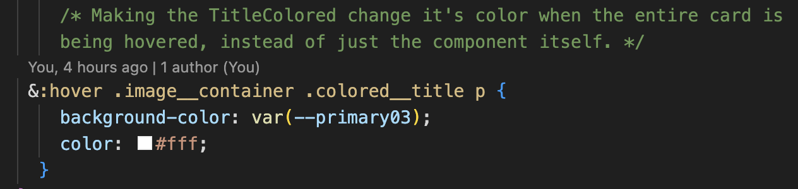
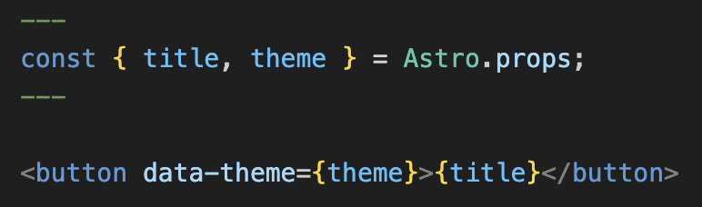
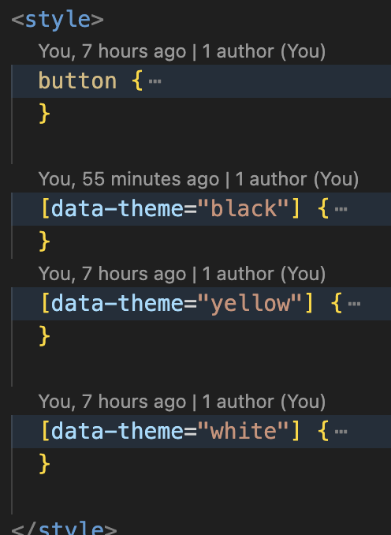
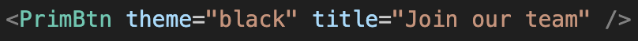
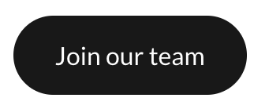

# A short reflection on This School Project

After a year of studying Multimedia Design, I still find it challenging to delegate my time and determine priorities, especially when it comes to working on multiple pages like this one. Despite all the struggles, I am generally happy with the result.

However, having said that, I must let you know that I completely forgot to make a burger menu for mobile view. So, good luck navigating on a viewport smaller than 600px. 🤥

## So, what are some more practical takeaways?

In earlier assignments, I often had the responsibility to work with slugs and data fetching, so that in itself wasn't too hard for me to figure out (thankfully). 

I believe the main struggles have been figuring out how to make things as simple as possible, especially with styling and structuring the websites and/or components. It sometimes feel as if I have to jump between dedicated .css files, pages and/or components to get the right train of action going. But towards the end, I was actually able to figure out how to communicate "across" files, which probably would have saved me some hours 😵‍💫

In this example above, I am inside the component of **SingleViewCard.astro**, where I want the **TitleColored.astro** component to change colour when the *entire card* is being ***hovered***. All of this because I wanted to reuse my one component instead of creating a new one or copying the one I already had. 

Overall, I feel as if I have gained a much better understanding of the usability of working with components, especially after learning about the use of **[data-theme]** values in CSS. It has not only sped up and simplified web development, but it has also become such a huge proponent *for* using components. It is just mad cool how one can create one simple button, that is essentially empty of all content, as seen in the picture below, and then easily be able to fill out with almost whatever you want.

All it has is one element, *<button>*, but it is using JavaScript (what you see in the curly braces {}) to dynamically set its attributes and content. And not only that, but Astro is pretty neat and handles all the js for this, so I don't have to deal with all of that routing as well. 

To finish up the talk about this very dear button, here is the general styling of it:

And here, the button is being used on the **team** page.

And voilá, a beautiful button, for the client-user! 

It's beautiful. 

